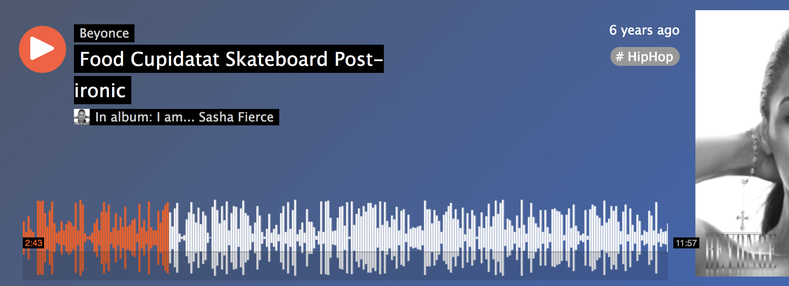

# StreamBoard Waveform Service

This is a React component for StreamBoard that renders a waveform for the song page.

## Related Components

  - https://github.com/StreamBoard98/suggestedTrackService
  - https://github.com/StreamBoard98/videoPlayerSkeletonService
  - https://github.com/StreamBoard98/commentsListandSubmissionService


## Table of Contents

1. [Usage](#Usage)
1. [Requirements](#requirements)
1. [Development](#development)

## Usage

> Some usage instructions

## Requirements

- Node 6.4.1

### Installing Dependencies

From within the root directory:

Make sure MongoDB is running.

```sh
npm install -g webpack
npm install
```

## Images
[](https://youtu.be/j5EBjo9fPQ4)<!-- .element height="50%" width="50%" -->